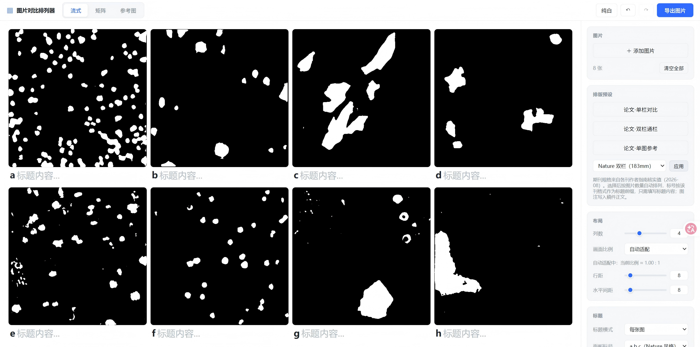

# 图片对比排列器 imgcmp

论文级多图对比排版工具：拖入图片，所见即所得排版，一键导出符合期刊规范的多面板对比图。

## 演示


<details>
<summary>静态截图（Nature 双栏模板）</summary>



</details>

## 核心特性

- **三种布局模式**：流式（自动换行）、矩阵（固定行列）、参考图（基准图 vs 候选图）
- **9 套期刊模板**：Nature / PNAS / IEEE / Cell / ACS / Lancet 单双栏规格，版心宽度、字号、面板标号格式均按各刊作者指南核实值预置
- **面板标号自动生成**：a b c / A B C / (a) (b) (c) 四种格式随期刊规范切换，拖拽重排后自动重新编号
- **300DPI 论文尺寸导出**：87–183mm 精确版心宽度，PNG 无损 / JPEG 92% / JPEG 85% 三档
- **所见即所得**：导出直接量测屏幕排版的真实位置与尺寸绘制，屏幕即成品
- **完整撤销/重做**：删除、清空、拖拽重排等破坏性操作均可回退（30 步）
- **自动存档**：关闭后再次打开可恢复上次项目

## 三个平台

| 平台 | 使用方式 |
|------|----------|
| uTools 插件 | uTools 插件市场搜索「图片对比」，或以 `imgcmp` 目录作为开发者插件加载 |
| 网页版 | GitHub Pages 在线使用（本仓库 `imgcmp/` 目录） |
| Windows 桌面版 | Releases 下载安装包（约 1.1 MB，Tauri + WebView2） |

## 使用

1. 拖入图片（支持 PNG / JPG / WebP / SVG / BMP / GIF）
2. 选择布局模式与列数、间距、画面比例
3. 点击图片输入标题；面板标号自动作为前缀
4. 选择期刊模板一键应用规范，或手动调整
5. 导出图片 → 自动命名 `图片对比_时间戳.png/jpg`

## 桌面版构建

```bash
cd imgcmp-tauri
npm install        # 安装 Tauri CLI
npm run dev        # 开发调试
npm run build      # 构建安装包（自动从 imgcmp/ 同步前端文件）
```

构建产物位于 `src-tauri/target/release/bundle/nsis/`，最终发布文件归档于 `dist/`。

## 目录结构

```
imgcmp/            插件核心（uTools 插件 = 网页版源码）
├── app.js         业务逻辑（排版/标号/导出/撤销）
├── platform.js    平台检测（Tauri → uTools → 浏览器）
├── *.adapter.js   各平台适配器
├── plugin.json    uTools 插件配置
└── screenshots/   功能截图
imgcmp-tauri/      Windows 桌面版（Tauri 2 + Rust）
```
